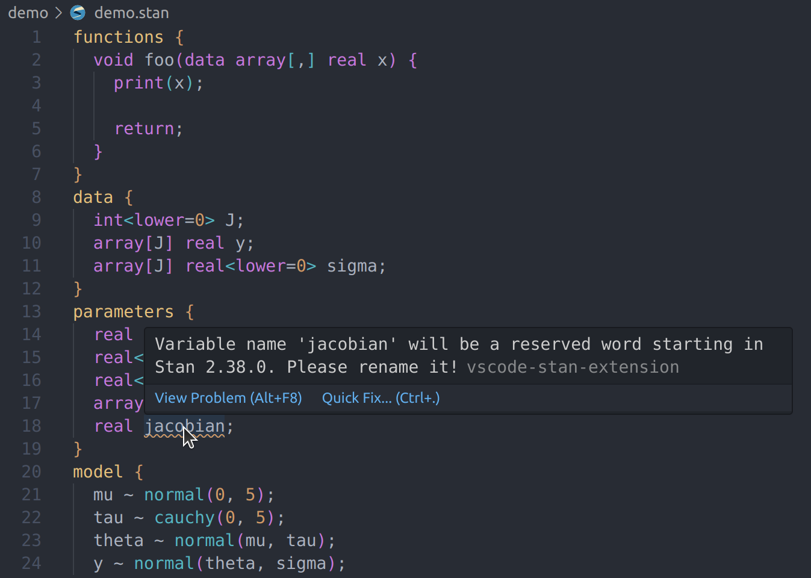
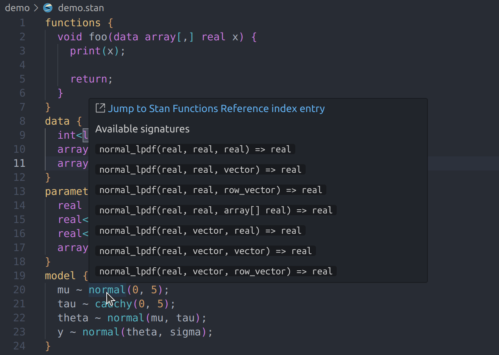

# vscode-stan-extension

[](https://marketplace.visualstudio.com/items?itemName=wardbrian.vscode-stan-extension)
[](https://open-vsx.org/extension/wardbrian/vscode-stan-extension)
[](https://github.com/WardBrian/vscode-stan-extension/actions/workflows/release.yaml)

This package adds syntax highlighting, code folding, formatting, linting, code suggestions,
and snippets for [Stan](https://mc-stan.org) files in [Visual Studio Code](https://code.visualstudio.com/).

## Features

### Syntax highlighting


### Linting



### Automatic formatting


### Snippets and code completion


### Hover information



### Code Folding


## Installation

```
code --install-extension wardbrian.vscode-stan-extension
```

or find and install it from the Extensions view.

Locally:

```
npm i
npm run build
code --install-extension ./vscode-stan-extension.0.5.0.vsix # change version as necessary
```

## Credits

This is a fork of the original [stan-vscode by ivan-bocharov](https://github.com/ivan-bocharov/stan-vscode).

The grammar was originally converted from the [atom-language-stan](https://github.com/jrnold/atom-language-stan) Stan package. The grammar has since been updated to support Stan v2.35.
