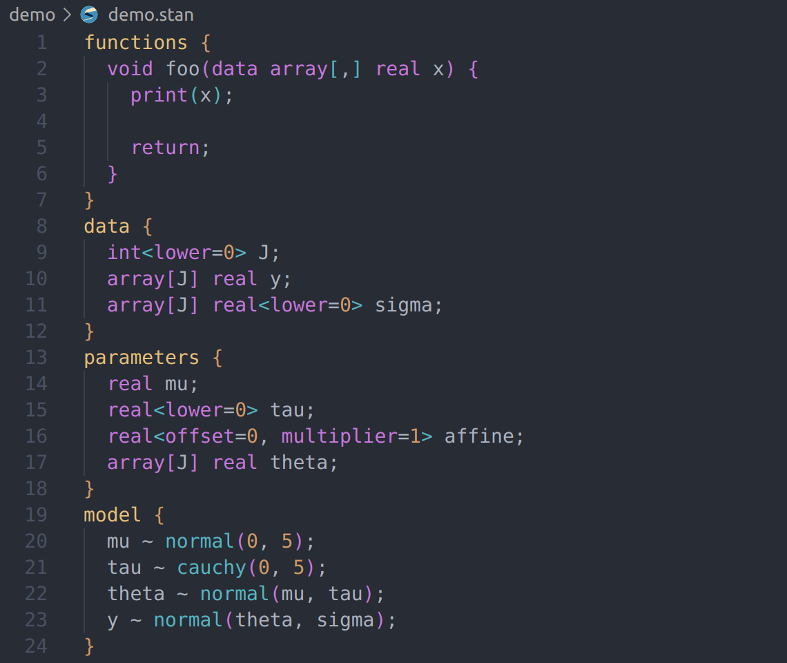
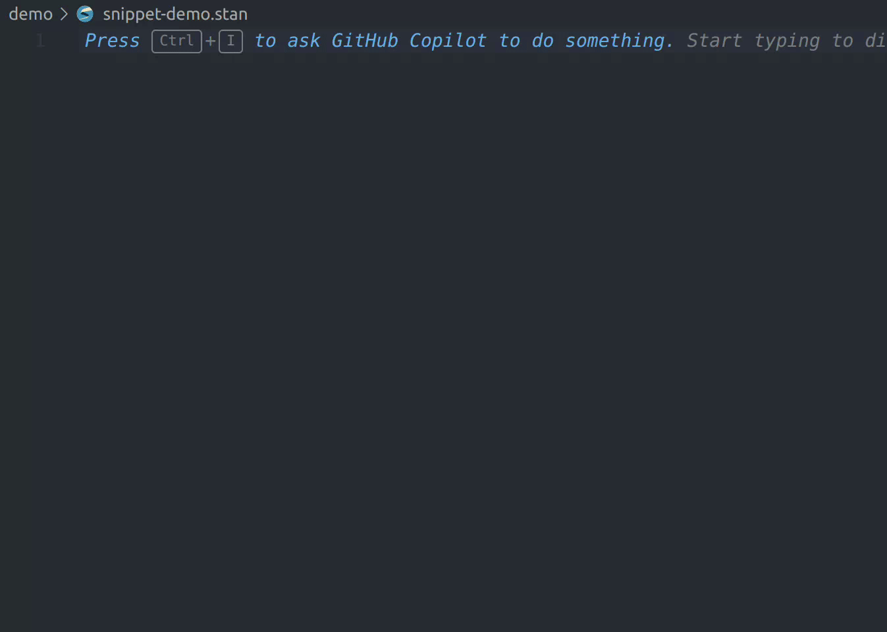
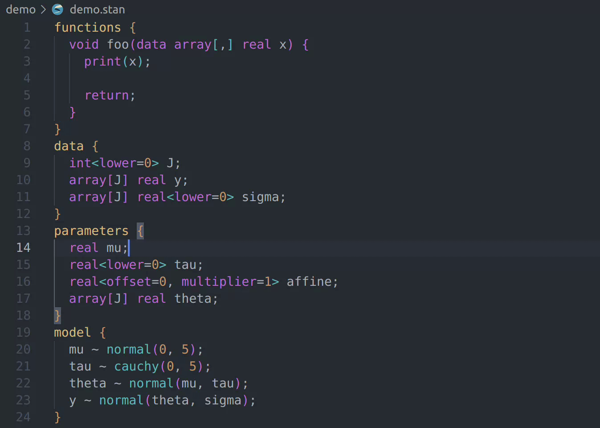
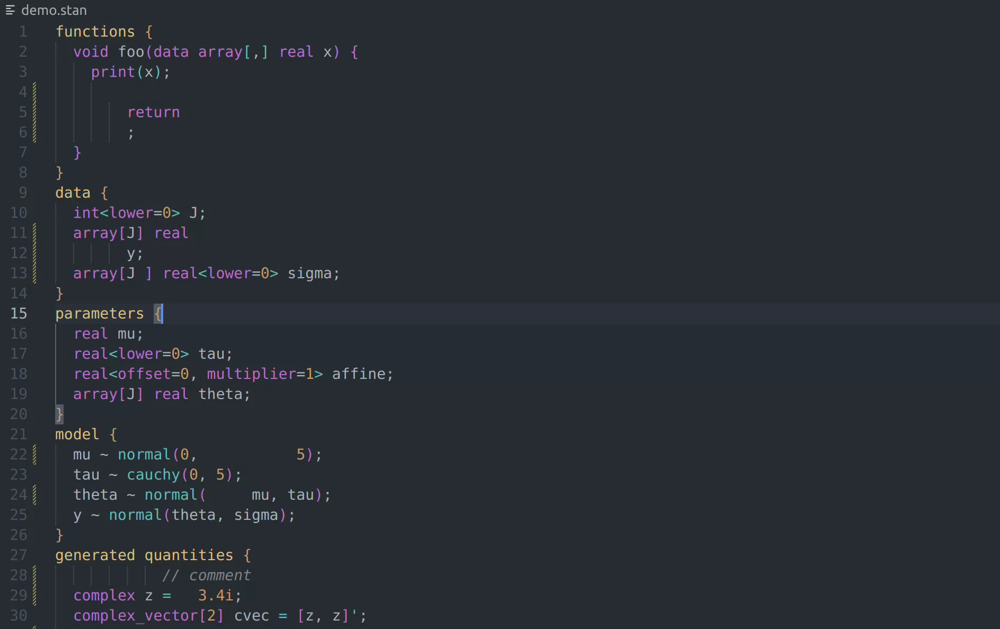

# vscode-stan-extension

This is a fork of the original [stan-vscode by ivan-bocharov](https://github.com/ivan-bocharov/stan-vscode).
It features more up-to-date syntax highlighting and auto-formatting for Stan files.

This package adds syntax highlighting, code folding, formatting, linting, and snippets for [Stan](https://mc-stan.org) files in [Visual Studio Code](https://code.visualstudio.com/).

The grammar was originally converted from the [atom-language-stan](https://github.com/jrnold/atom-language-stan) Stan package. The grammar has since been updated to support Stan v2.35.

## Features

### Syntax highlighting



### Snippets



### Code Folding



### Formatting on save



## Installation

```
code --install-extension wardbrian.vscode-stan-extension
```

or find and install it from the Extensions view.

Locally:

```
npm i
npm run build
code --install-extension ./vscode-stan-extension.0.5.0.vsix # change version as necessary
```
